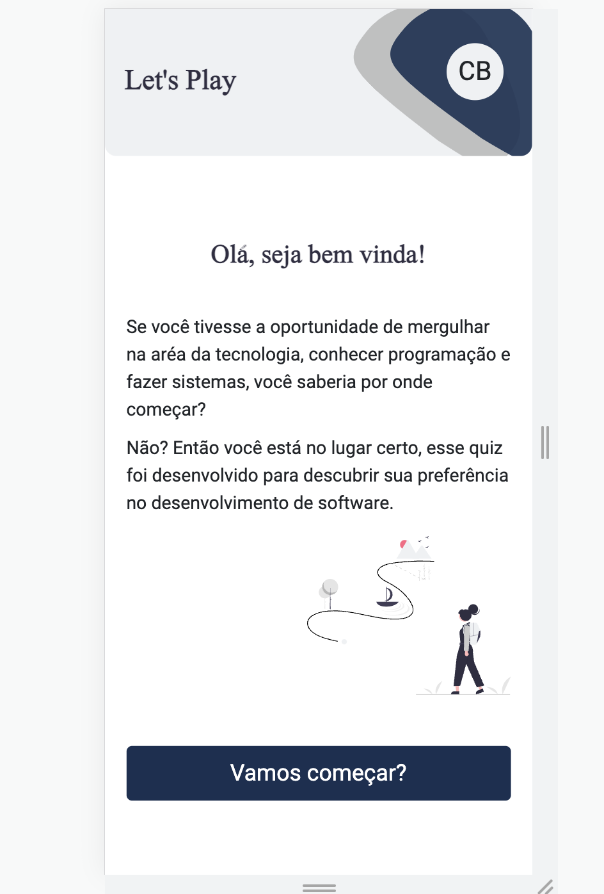
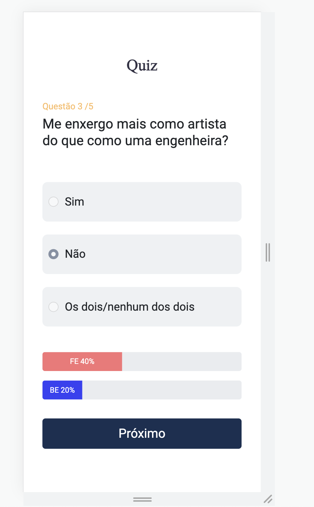
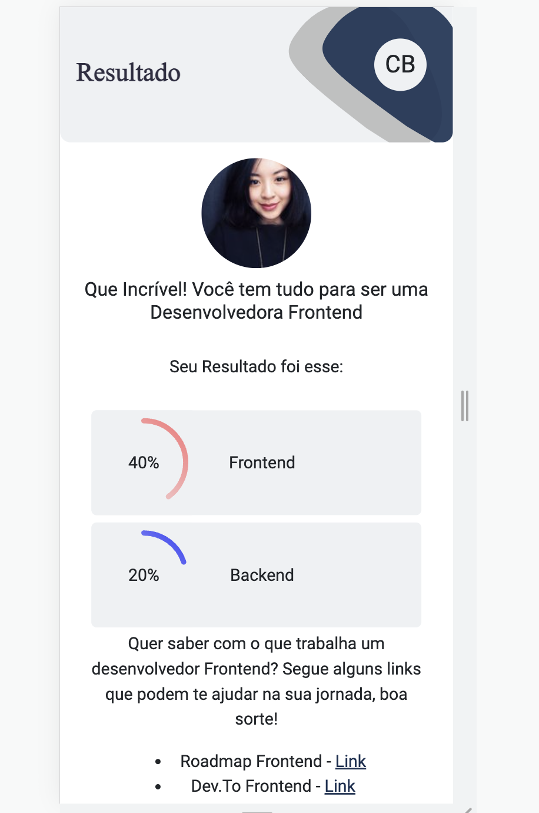

# Teste de Vocação

 

* [Overview](#overview)
* [Objetivo do Projeto](#obejetivo-do-projeto)
* [Status do Projeto](#status-do-projeto)
* [Funcionalidades do Projeto](#funcionalidades-do-projeto)
* [Acesso ao Projeto](#acesso-ao-projeto)
* [Tecnologias utilizadas](#tecnologias-utilizadas)
* [Autor](#autor)

## Overview

### Obejetivo do Projeto

O projeto visa ajudar pessoas que tem interesse em desenvolvimento de software a escolher uma aréa entre Frontend e Backend a partir dos seus gostos e afinidades.

### Status do Projeto 
Concluido ✅

### Funcionalidades do Projeto

* Formulário de login populado com dados da api
* Quiz com perguntas vindas de um JSON
* Perguntas e respostas sendo atualizadas a partir do botão de próximo
* Barra de progresso atualizada a partir da resposta do usuário
* Resultado final com a porcentagem de Frontend e Backend demostradas em um gráfico

 
 
 

### Tecnologias utilizadas

* React.js
* Context Provider
* React Router
* React Gradient Progress
* Sass
* Mobile First
* Bootstrap
* Axios

### Acesso ao Projeto

* Vercel - https://vocation-test.vercel.app/
### Autor

 - Linkedin - [Ylana Portela](https://www.linkedin.com/in/ylana-portela/)

